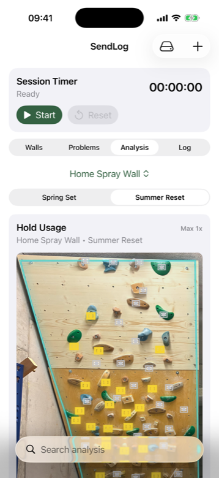

# SendLog

SendLog is an offline-first iOS app for home boards, spray walls, and training resets. Photograph your wall, detect holds locally, build climbs directly on the image, log your sessions, and keep old problems useful when the set changes.

The app is built for climbers who treat their board as a living training tool: holds get added, partial resets happen, projects come back, and the most useful data is the stuff that survives all of that.

## Screenshots

<p>
  
  
  
  
</p>

## Why SendLog

Most board apps are good at storing a climb once. SendLog is designed around what happens after that: you change the board, add a few holds, replace part of the set, and still want your old climbs, logs, and training history to make sense.

### Wall inheritance

Create a new set from an existing wall and bring old climbs forward. SendLog automatically matches holds from the old set to the new layout using position, wall geometry, and hold appearance, then lets you review the imported problems before saving them.

This is the core idea: your climbs should not disappear just because the board evolved.

### Fully local hold detection

Hold detection runs on-device with the bundled Core ML model. No cloud upload, no server dependency, and no internet requirement. After detection, every hold box can still be tweaked manually: add missed holds, move boxes, resize them, or delete noisy detections.

### Hold usage analysis

Use the analysis view to see which holds appear most often across a set. The heat map makes it easier to spot overused holds, neglected board zones, and opportunities for more balanced setting.

### Climb logging

Log attempts and ticks directly from saved problems. SendLog keeps climb-level history and session context so your board becomes more than a photo with colored boxes.

### Portable backups

Export and import complete JSON backups, including walls, resets, holds, problems, logs, and wall images.

## Features

- Manage multiple walls and multiple resets per wall.
- Mark the climbable wall area to keep hold detection and matching focused.
- Detect holds fully offline with Core ML.
- Manually add, remove, move, and resize hold boxes.
- Create problems by tapping holds on the wall image.
- Save grades, notes, primary holds, and secondary/foot holds.
- Import old climbs into new sets with automatic hold matching.
- Analyze hold usage across a set.
- Log attempts, ticks, and sessions.
- Search and filter the wall, problem, analysis, and log views.
- Export/import full backups for portability.

## Typical Workflow

1. Import a wall photo.
2. Draw or adjust the wall area.
3. Run local hold detection.
4. Tweak any detected holds that need cleanup.
5. Build climbs by selecting holds on the wall.
6. Log attempts and sends over time.
7. When the wall changes, create a new reset and import old climbs into the new set.
8. Use hold analysis to understand what your setting has been emphasizing.

## Project Setup

1. Install full Xcode from the App Store.
2. Install XcodeGen:

   ```bash
   brew install xcodegen
   ```

3. Generate the Xcode project:

   ```bash
   xcodegen generate
   ```

4. Open the project:

   ```bash
   open SendLog.xcodeproj
   ```

5. Choose an iOS Simulator or device and run.

## Development Notes

- Minimum deployment target: iOS 17.
- UI: SwiftUI.
- Hold detection: bundled Core ML model, fully local.
- Persistence: local app storage with JSON backup export/import.

## Privacy

SendLog is designed to work offline. Wall photos and climb data stay on the device unless you explicitly export a backup.
