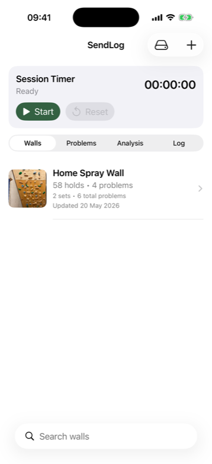
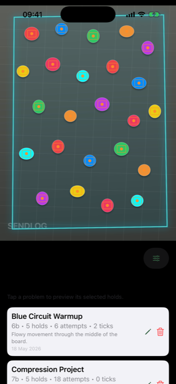
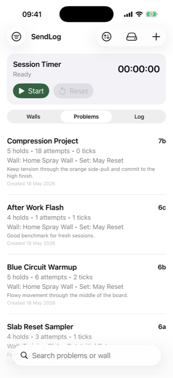

# SendLog

SendLog is an offline-first iOS companion for home boards, spray walls, and training resets. Manage every wall and reset in one place, detect holds locally on-device, build boulders directly on the photo, and keep your training history useful across every board change.

It is designed for the messy, useful reality of board climbing: full resets, partial resets, old projects that deserve a second life, tiny tweaks to hold boxes, project notes, attempts, ticks, search, grade filters, and backups that keep your wall data portable.

## Screenshots

<p>
  
  
  
</p>

## Features

- Manage walls and resets as first-class training surfaces, with support for multiple sets on the same wall.
- Handle partial resets without losing context: keep the wall, update the set, and continue tracking what changed.
- Detect holds fully offline with the bundled FastSAM/Core ML model, so wall setup works without network calls or cloud uploads.
- Manually add, remove, move, and resize hold boxes when a photo, shadow, or unusual hold shape needs a human touch.
- Import existing boulders into a new set by matching old holds to the new layout, then review and approve the translated problem.
- Tap holds to compose boulder problems with grades, notes, starts, finishes, and selected footholds.
- Use hold analysis to see which holds are used most often, spot neglected zones, and build more balanced problems.
- Track attempts, ticks, and session time without leaving the app.
- Browse all walls, problems, and log entries with search, sorting, and grade filters.
- Export and import a full JSON backup of walls, holds, problems, session logs, and wall images.

## Project setup (VS Code + Xcode)
1. Install full Xcode from the App Store.
2. Install XcodeGen:
   ```bash
   brew install xcodegen
   ```
3. Generate the project:
   ```bash
   xcodegen generate
   ```
4. Open `SendLog.xcodeproj` in Xcode:
   ```bash
   open SendLog.xcodeproj
   ```
5. Pick an iOS Simulator and run.

## Why Xcode is still required
You can edit Swift files in VS Code, but iOS Simulator builds/signing rely on the iOS SDK tooling bundled with full Xcode.
